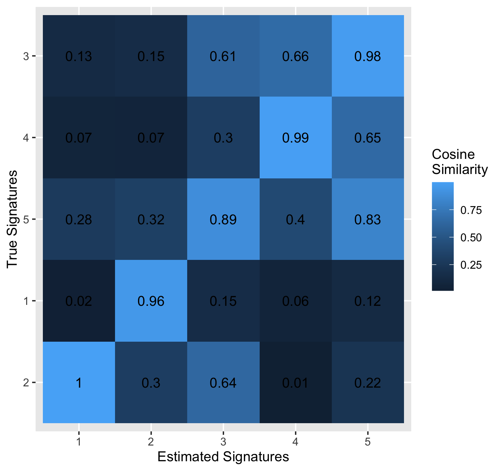

# bayesNMF: an R package for Bayesian NMF

## Notes

Hello! This package is a **work in progress** and new features will be added periodically.

The following likelihood - prior combinations have been implemented:

- Poisson - Gamma: $M \sim Poisson(PE)$, $P$ and $E$ follow Gamma priors
- Poisson - Exponential: $M \sim Poisson(PE)$, $P$ and $E$ follow Exponential priors
- Normal - Truncated Normal: $M_k \sim N((PE)_k, \sigma^2_k I)$, $P$ and $E$ follow Truncated-Normal priors, $\sigma^2_k$ follows an Inverse-Gamma prior
- Normal - Exponential: $M_k \sim N((PE)_k, \sigma^2_k I)$, $P$ and $E$ follow Exponential priors, $\sigma^2_k$ follows an Inverse-Gamma prior 

While language and simulation examples are in the context of mutational signatures analysis, this package can be used for any application of NMF.

## Quick Start

### Installation

```{r}
library(devtools)
devtools::install_github("jennalandy/bayesNMF")
library(bayesNMF)
```

### Use

The main function is `bayesNMF`, which runs a Gibbs sampler and reports the MAP estimates.

As with standard NMF, `bayesNMF` requires the latent rank `N` be provided.

```{r}
rank5_results <- bayesNMF(
    M, N = 5, 
    likelihood = "normal", 
    prior = "truncnormal", 
    file = "my_run_rank5"
)
```

Three files will be created and updated every 100 iterations by default (can be controlled with the `logevery` parameter) 

- `my_run_rank5.log` will log the start time and the progress of the Gibbs sampler, which is useful to estimate the total run time if using a large dataset or a lot of iterations. 
- `my_run_rank5.RData` records the current results, which is be useful if your run is cut short (the dreaded OOM error). Once the function is complete, this records complete results for future access. 
- `my_run_rank5.pdf` updates three plots: RMSE, KL Divergence, and log likelihood over iterations. Note that log likelihood is specific to the likelihood used, so values from the Poisson models are not comparable to those from Normal models.

The maximum a-posteriori (MAP) estimates for $P$ and $E$ are stored in `rank5_results$MAP$P` and `rank5_results$MAP$E`. The full Gibbs sampler chains are stored in `rank5_results$logs`. The reconstruction errors and log likelihood for each iteration are stored in `rank5_results$metrics`.

### Learning Rank

For models with conjugacy (Normal - Truncated Normal and Poisson - Gamma), we have also implemented an option to *learn the rank* provided `max_N` instead.

```{r}
learned_rank_results <- bayesNMF(
    M, max_N = 7, 
    likelihood = "normal", 
    prior = "truncnormal", 
    file = "my_run_learned_rank"
)
```

Here, an additional matrix $A$ is estimated, which determines which latent factors are included in the final model. `learned_rank_results$MAP$A` is dimension 1 by `max_N`. For each position $n$, a 1 indicates factor $n$ is included, while a 0 indicates the factor was dropped. Dropped factors have already been removed from `learned_rank_results$MAP$P` and `learned_rank_results$MAP$E`.

### Compare to True Signatures

We also include commands to compare estimated signatures to the true signatures matrix to evaluate simulation studies. This could also be a set of signatures from literature that we wish to use as a baseline.

The following functions provide a similarity matrix between the true and estimated $P$ matrices, as well as a heatmap to visualize this.

```{r}
sim_mat <- pairwise_sim(res$MAP$P, true_P)
heatmap <- get_heatmap(est_P = res$MAP$P, true_P = true_P)
```

You can also do this all in one call. If `true_P` is provided to `bayesNMF`, then the similarity matrix and heatmap are stored in `res$sim_mat` and `res$heatmap`, respectively.

```{r}
rank5_results <- bayesNMF(
    M, N = 5, 
    likelihood = "normal", 
    prior = "truncnormal", 
    file = "my_run_rank5",
    true_P = true_P
)
```

## Simulated Example

### 1. Simulate Data

Here we simulate a mutational catalog based on a subset of COSMIC signatures, available at the link below. We use 5 of the COSMIC signatures as the true P matrix.

```{r}
set.seed(123)

sigs = c(2,3,4,5,6)
N = length(sigs)
P <- read.csv(
  "https://cog.sanger.ac.uk/cosmic-signatures-production/documents/COSMIC_v3.3.1_SBS_GRCh37.txt",
  sep = '\t'
)
P <- as.matrix(P[,sigs])
K = nrow(P)
```

We then simulate exposure values, for example here from an exponential distribution. We generate exposures for G = 20 samples.

```{r}
G = 20
E <- matrix(rexp(N*G, 0.001), nrow = N, ncol = G)
```

Assuming a Poisson data generating function, we can finally simulate a mutational catalog $M$.

```{r}
M <- matrix(nrow = K, ncol = G)
for (k in 1:K) {
    M[k,] <- rpois(G, P[k,]%*%E)
}
```

Below shows the six number summary for the number of mutations per sample. We see that the central 50% of generated samples have between 2963 and 5231 mutations.

```{r}
summary(colSums(M))
```

```
   Min. 1st Qu.  Median    Mean 3rd Qu.    Max. 
   1699    2963    4891    5231    7410    9845
```

### 2. Running Methods

Now we can run the Normal-Exponential model of Bayesain NMF.

```{r}
res <- bayesNMF(
  M, N = 5,
  likelihood = "normal",
  prior = "truncnormal",
  file = "my_run",
  true_P = P
)
```

### 3. Evaluating Methods

Metrics are always recorded on each iteration. Here we look at the metrics on the last iteration.

```{r}
data.frame(res$metrics)[res$niters,]
```

```        
         loglik     RMSE       KL
1500 -191938493 5.679985 792.8074
```

The similarity matrix and corresponding heatmap are only provided if
`true_P` is used.

```{r}
res$sim_mat
```

```         
                true1      true2     true3      true4     true5
estimated1 0.02424170 0.99924989 0.1298875 0.06788912 0.2774230
estimated2 0.95511900 0.30313309 0.1460383 0.06711596 0.3237289
estimated3 0.14618485 0.63629489 0.6070845 0.30329985 0.8874797
estimated4 0.06009177 0.01311398 0.6603101 0.99498287 0.4026305
estimated5 0.12359146 0.21950484 0.9810274 0.64979449 0.8274775
```

```{r}
res$heatmap
```

{width="491"}

Notice that signatures are reordered on the heatmap, assigned using the
Hungarian algorithm. To see this assignment on the similarity matrix,
you can use the `assign_signatures` function. Here, we can see that our estimated factor 1 was assigned matches best to the true factor 2.

```{r}
assigned_sim_mat = assign_signatures(res$sim_mat)
assigned_sim_mat
```

```
                true2      true1     true5      true4     true3
estimated1 0.99924989 0.02424170 0.2774230 0.06788912 0.1298875
estimated2 0.30313309 0.95511900 0.3237289 0.06711596 0.1460383
estimated3 0.63629489 0.14618485 0.8874797 0.30329985 0.6070845
estimated4 0.01311398 0.06009177 0.4026305 0.99498287 0.6603101
estimated5 0.21950484 0.12359146 0.8274775 0.64979449 0.9810274
```
