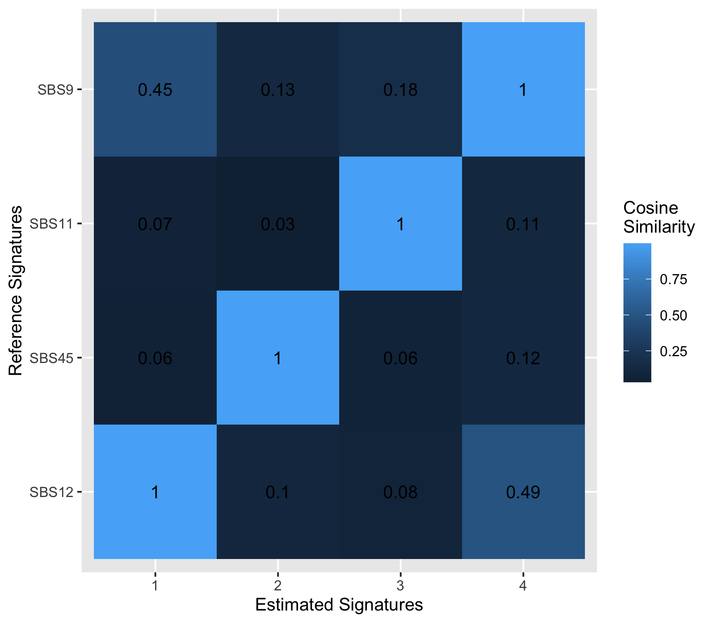
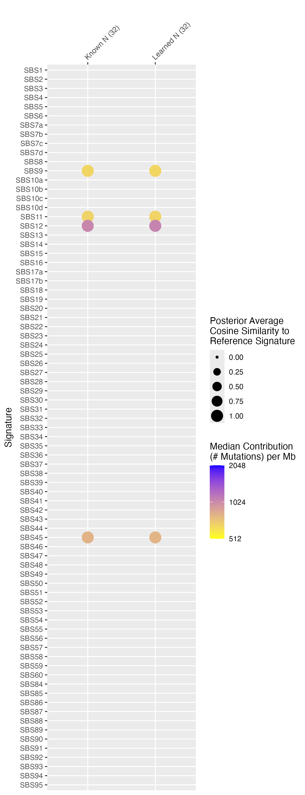
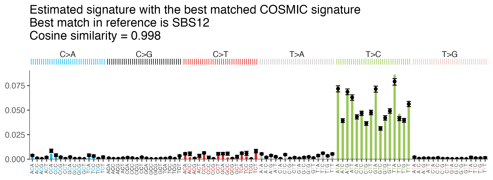
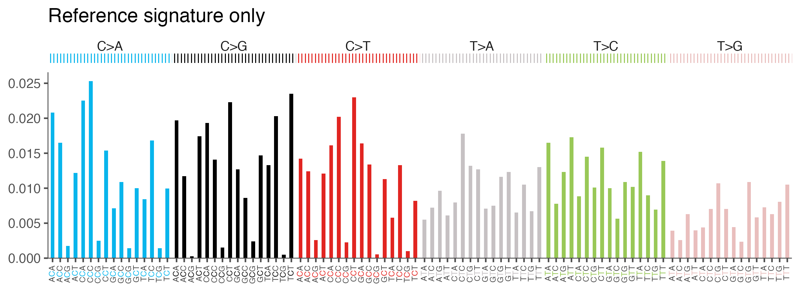
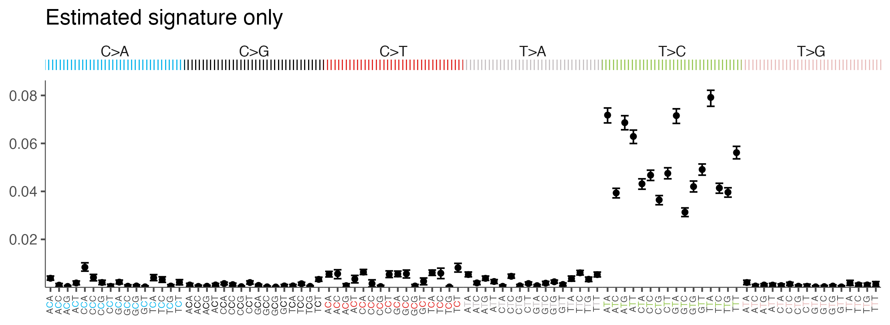
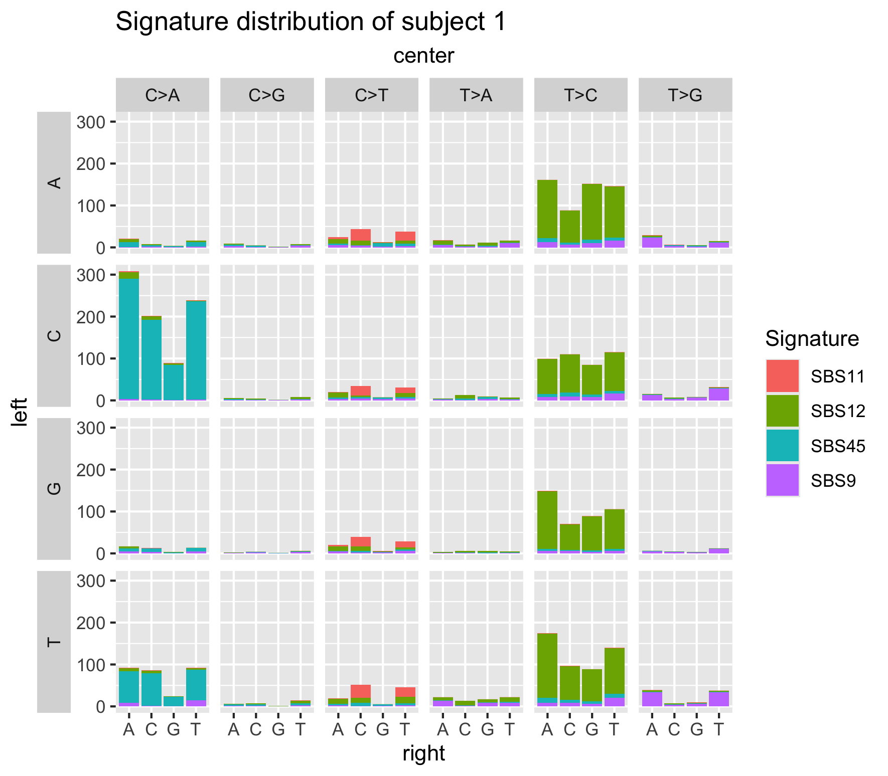

# bayesNMF: an R package for Bayesian NMF

Introduced in the paper ["bayesNMF: Fast Bayesian Poisson NMF with Automatically Learned Rank Applied to Mutational Signatures"](https://arxiv.org/abs/2502.18674), this package implements Gibbs samplers for multiple models of Bayesian non-negative matrix factorization (NMF), including Poisson NMF with our custom MH-with-Gibbs approach. Code to reproduce results from our paper can be found in the [bayesNMF_PAPER](https://github.com/jennalandy/bayesNMF_PAPER) repository.

More detailed documentation can be found in vignettes:

- [Understanding bayesNMF Output](vignettes/output.pdf)
- [Inference and Visualization](vignettes/inference_visualization.pdf)

## Quick Start

### Installation

```{r}
library(devtools)
devtools::install_github("jennalandy/bayesNMF")
library(bayesNMF)
```

### Use

For example purposes, we use a dataset of 32 samples simulated from 4 signatures.

```{r}
data <- readRDS("examples/N4_G32_rep1.rds")
dim(data$M)
```

```         
[1] 96 32
```

The `bayesNMF` R software package allows users to fit all models defined in the paper with the `bayesNMF` function. Model specifications can be adjusted by the `likelihood` (default `"poisson"`) and `prior` (default `"truncnormal"`) parameters. The `rank` parameter can be a fixed value or a range vector. For example:

```{r}
res_fixedN <- bayesNMF(
    data$M, rank = 4,
    file = "examples/res_fixedN"
)
```

## Models

The following likelihood - prior combinations have been implemented and benchmarked in our paper:

-   Poisson - Gamma: $M \sim Poisson(PE)$, $P$ and $E$ follow Gamma priors
-   Normal - Truncated Normal: $M_k \sim N((PE)_k, \sigma^2_k I)$, $P$ and $E$ follow Truncated-Normal priors, $\sigma^2_k$ follows an Inverse-Gamma prior
-   *fast* Poisson - Truncated Normal: utilizes approximate metropolis steps to avoid Poisson augmentation

The following models have also been implemented. We recommend using with caution as these have yet to be benchmarked:

-   Poisson - Exponential: $M \sim Poisson(PE)$, $P$ and $E$ follow Exponential priors. Must specify `fast = FALSE`, as default is to use `fast` whenever applicable.
-   Normal - Exponential: $M_k \sim N((PE)_k, \sigma^2_k I)$, $P$ and $E$ follow Exponential priors, $\sigma^2_k$ follows an Inverse-Gamma prior
-   *fast* Poisson - Exponential: utilizes approximate metropolis steps to avoid Poisson augmentation

This package also specifies a recovery-discovery version of this approach to fix prior parameters at previosuly discovered signatures while learning rank with BFI or SBFI. We again recommend using with caution as this approach has yet to be benchmarked.

While language and simulation examples are in the context of mutational signatures analysis, this package can be used for any application of NMF.

## Package Details

### Model Fitting

#### `bayesNMF` with Known Rank

```{r}
res_fixedN <- bayesNMF(
    data$M, rank = 4,
    file = "examples/res_fixedN",
    store_logs = FALSE,
    overwrite = TRUE
)
```

Three files will be created and updated every 100 iterations (can be controlled with `convergence_control`):

-   `res_fixedN.log` will log the start time and the progress of the Gibbs sampler, which is useful to estimate the total run time if using a large dataset or a lot of iterations.
-   `res_fixedN.rds` periodically records results, which is be useful if your run is cut short (the dreaded OOM error). Once the run is complete, this records complete results for future access.
-   `res_fixedN.pdf` updates plots of metrics: RMSE, KL Divergence, BIC, log posterior, log likelihood, and latent rank of periodically computed MAP estimates (see the section on convergence below for details). Note that for log likelihood and log posterior, values from the Poisson models are not comparable to those from Normal models.

The maximum a-posteriori (MAP) estimates for $P$ and $E$ are stored in `res_fixedN$MAP$P` and `res_fixedN$MAP$E`. The full Gibbs sampler chains are stored in `res_fixedN$logs` if `store_logs = TRUE` (default), and the 1000 posterior samples used to compute MAP estimates are stored in `res_fixedN$posterior_samples` either way. The periodic metrics of MAP estimates displayed in `res_fixedN.pdf` are stored in `res_fixedN$metrics`.

```{r}
dim(res_fixedN$MAP$P)
```

```         
[1] 96  4
```

```{r}
dim(res_fixedN$MAP$E)
```

```         
[1]  4 32
```

#### `bayesNMF` with Learned Rank

If a vector is provided to `rank`, the `learn_rank_method` parameter can be set to one of the following: `"heuristic"` (optimizing BIC), `"SBFI"` (default), or `"BFI"`.

```{r}
res_learnN <- bayesNMF(
    data$M, rank = 1:5,
    learn_rank_method = "SBFI",
    file = "examples/res_learnN",
    overwrite = TRUE
)
```

When rank is learned, a factor inclusion matrix $A$ tells us which factors are included in the final model ($A_{n} = 1$) and which are excluded ($A_{n} = 0$). The `res_learnN.log` file will record the sampler progress as before, but will also list how many times each of five most frequent $A$ matrices were sampled in the previous 1000 samples. Looking at the final MAP estimate of the $A$ matrix can tell us the learned latent rank (in this case, 4):

```{r}
res_learnN$MAP$A
```

```         
     [,1] [,2] [,3] [,4] [,5]
[1,]    0    1    1    1    1
```

The MAP estimates of P and E have already been reduced to this subset of included signatures:

```{r}
dim(res_learnN$MAP$P)
```

```         
[1] 96  4
```

#### `bayesNMF` with Recovery-Discovery

::: {style="color: red;"}
Warning: this method has yet to be benchmarked.
:::

If `recovery = TRUE`, bayesNMF will fix prior parameters to previously discovered signatures, while still allowing discovery of `rank` additional signatures. This is particularly useful in the context of mutational signatures, where we may want our recovery priors to match the reference signatures in the [COSMIC database](https://cancer.sanger.ac.uk/signatures/). Setting `recovery_priors = "cosmic"` (default) will load recovery priors pre-defined based on COSMIC v3.3.1 SBS GRCh37.

This model learns to include up to 79 recovery signatures and up to 5 discovery signatures (up to 84 total). Note: this is very computationally intensive due to the large range of latent ranks considered.

```{r}
learned_rank_recovery_discover_cosmic_results <- bayesNMF(
    data$M, rank = 1:5, 
    likelihood = "poisson", 
    prior = "truncnormal", 
    file = "examples/res_recovery_cosmic",
    recovery = TRUE,
    recovery_priors = "cosmic",
    overwrite = TRUE
)
```

Alternatively, a `P` matrix and model specifications can be provided to the `get_recovery_priors` function to generate recovery priors that can then be passed to `bayesNMF`. This model learns to include up to 4 recovery signatures and up to 5 discovery signatures.

```{r}
recovery_priors = get_recovery_priors(
    literature_P,
    likelihood = "poisson",
    prior = "truncnormal",
    file = "examples/literature_P_recovery_priors_NT"
)
learned_rank_recovery_discover_results <- bayesNMF(
    data$M, rank = 1:5, 
    likelihood = "poisson", 
    prior = "truncnormal", 
    file = "examples/res_recovery",
    recovery = TRUE,
    recovery_priors = recovery_priors,
    overwrite = TRUE
)
```

In the recovery-discovery mode, the prior probability of signature inclusion is such that recovery signatures are twice as likely to be included as discovery signatures, a priori.

### Downstream Analysis and Visualization

#### Compare to Reference Signatures

After running `bayesNMF`, many users may wish to compare the estimated factors to reference factors. For example, this could be the true factors used to generate a simulation study or a set of factors from literature. Commonly for mutational signatures, this is the COSMIC set of references. We include a helper function to easily load the COSMIC v3.3.1 SBS GRCh37 reference signatures:

```{r}
ref_matrix <- get_cosmic()
dim(ref_matrix)
```

```         
[1] 96 79
```

The following functions provide a similarity matrix between the true and estimated $P$ matrices, as well as a heatmap to visualize this.

```{r}
sim_mat <- pairwise_sim(res_fixedN$MAP$P, ref_matrix)
get_heatmap(est_matrix = res_fixedN$MAP$P, ref_matrix = ref_matrix)
```



The `signature_asssignment_inference` performs the signature assignment approach described in our paper. To align estimated factors to the reference factors, we first create a similarity matrix $S$, where each element is the cosine similarity between a column of $P$ and a column of $\hat P$, $S_{ij} = cos(P_i, \hat{P}_j)$. The [Hungarian algorithm](https://doi.org/10.1002/nav.3800020109) is used on $-1\cdot S$, which solves the combinatorial optimization problem to reorder rows and columns to minimize the sum of values on the diagonal. The resulting aligned similarity matrix, $S^*$, has an optimal alignment in terms of total aligned cosine similarity. This approach only allows a single estimated signature to be aligned to each reference signature.

We incorporate posterior uncertainty into this process by performing factor alignment for each of the posterior samples used to compute $\hat P$. We determine final alignments through majority voting with cosine similarity as voting weights.

```{r}
assign <- signature_asssignment_inference(res_fixedN)
assign$assignment
```

```         
    sig score n
1 SBS12     1 1
2 SBS45     1 2
3 SBS11     1 3
4  SBS9     1 4
```

The assignment object also includes average and 95% credible intervals of cosine similarities across posterior samples.

```{r}
assign$MAP$cos_sim
```

```{r}
    SBS12     SBS45     SBS11      SBS9 
0.9981176 0.9980450 0.9972662 0.9955704
```

```{r}
assign$credible_intervals$cos_sim
```

```         
[[1]]
    SBS12     SBS45     SBS11      SBS9 
0.9974520 0.9976177 0.9964433 0.9937027 

[[2]]
    SBS12     SBS45     SBS11      SBS9 
0.9986952 0.9984327 0.9981941 0.9971524 
```

These inference results can be visualized with a dot plot as seen in Figure 3 of our paper with the `plot_results` function. One or more `bayesNMF` results objects are passed to `res_list`--each of these results objects will become a column in the produced figure. The function also returns a data frame containing all relevant metrics.

```{r, fig.width = 10, fig.height = 20}
inference_plot <- plot_results(
    res_list = list(
        "Known N" = res_fixedN,
        "Learned N" = res_learnN
    )
)
head(inference_plot$df)
```

```         
            Name Signature  G Med_Contribution Cosine_Similarity
1   Known N (32)     SBS11 32         668.4555         0.9972662
2   Known N (32)     SBS12 32        1045.5493         0.9981176
3   Known N (32)     SBS45 32         800.1429         0.9980450
4   Known N (32)      SBS9 32         653.6192         0.9955704
5 Learned N (32)     SBS11 32         659.7419         0.9969646
6 Learned N (32)     SBS12 32        1063.7996         0.9979717
```

```{r}
inference_plot$plot
```



#### Visualize Estimated Signatures

The `plot_sig` function visualizes an estimated mutational signature, displaying reference signatures as bar plots in the style of the [COSMIC database](https://cancer.sanger.ac.uk/signatures/sbs/) and MAP estimates and 95% credible intervals as a point with whiskers. It takes in a `bayesNMF` results object, `res`, and the index of the signature to be plotted. By default, this function will align the estimated signature to its best match in the reference, or a specific signature index or name can be passed to the `ref` parameter.

```{r}
plot_sig(
    res = res_fixedN, sig = 1, 
    title = "Estimated signature with the best matched COSMIC signature"
)
```



This function can also be used to plot a reference or estimated signature alone:

```{r}
plot_sig(
    ref = "SBS3",
    title = "Reference signature only"
)
```



```{r}
plot_sig(
    res = res_fixedN, sig = 1, ref = NULL,
    title = "Estimated signature only"
)
```



We can visualize all mutations from all signatures in all or a subset of subjects with `plot_signature_dist`. This gives a clear picture of what mutations are present as well as what signatures they arise from.

```{r}
plot_signature_dist(
    res = res_fixedN, 
    subject = 1, # optional, all combined if not specified
    title = "Signature distribution of subject 1"
)
```


